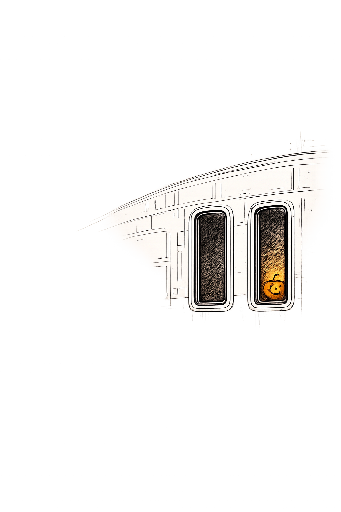

Captain Matthew McClendon, Commanding Officer.

Captain's Log, Stardate 78832.477.

---

It is 2030 hours on October 31, 2401.

Halloween.

For most of Earth's history, the holiday served as an excuse to wear costumes, consume unreasonable amounts of sugar, and briefly become someone else.

Starfleet eventually embraced the tradition with characteristic enthusiasm.

Over the years I have attended Halloween celebrations aboard more starships than I can readily count.

There were haunted holodeck programs.

Questionable costume contests.

Replicated pumpkins that somehow appeared in every department regardless of official policy.

The memory remains a pleasant one.

This year is different.

USS Kepler is not yet empty, though she is not yet fully inhabited either.

The senior staff continues to arrive in stages.

Additional personnel are still en route.

Entire sections of the ship remain dark each evening.

The Forward Lounge contains more chairs than conversations.

The Arboretum contains more plans than plants.

The ship remains suspended between construction and community.

It did not feel entirely appropriate to allow Halloween to pass unobserved.

Accordingly, I replicated a small jack-o'-lantern and placed it in the window of my ready room overlooking the bridge.

The effect was modest.

At present, there are not enough people aboard Kepler to appreciate such things.

Nevertheless, the small orange light remained visible against the darkness of the unfinished ship.

For a few hours, it transformed an empty ready room into something that felt occupied.

Traditions, like communities, often begin with a single participant.

I spent part of the afternoon reviewing incoming personnel reports and readiness assessments with Chief Engineer Brokkar.

His latest report contained considerably fewer unresolved issues than the previous one.

I suspect this is his preferred method of expressing satisfaction.

Mine remains optimistic.

Progress continues.

The crew manifest grows larger each week.

Names gradually become faces.

Faces gradually become colleagues.

Eventually they will become a crew.

For now, much of Kepler still exists in the future.

I returned to Starbase 718 shortly before dusk.

Several families stationed aboard the starbase had organized activities for their children.

The corridors were filled with costumes, laughter, and an impressive number of small monsters demanding candy from unsuspecting officers.

The tradition appears healthy.

I found myself wondering what Halloween aboard Kepler might look like next year.

By then the ship will be different.

The lounges will be occupied.

The corridors will be familiar.

The traditions will belong to the crew rather than the shipyard.

Perhaps that is the real purpose of holidays.

Not simply to remember where we came from.

To remind us what we are building together.

For now, Kepler waits.

Soon enough, she will have ghosts, stories, traditions, and favorite decorations of her own.

I look forward to meeting them.

End log.